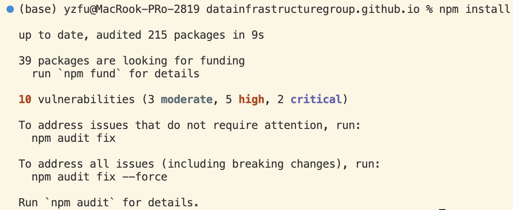
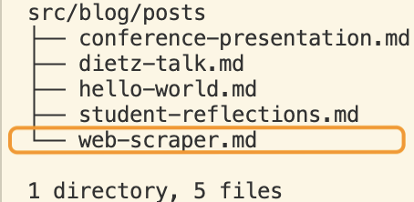
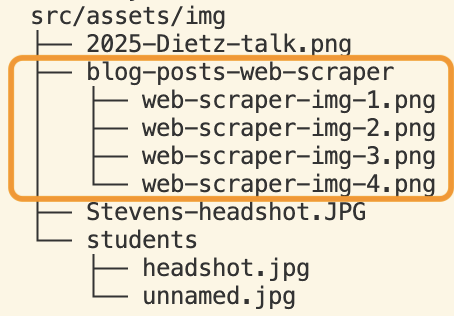
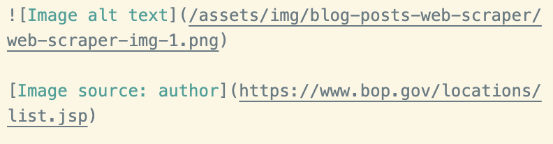
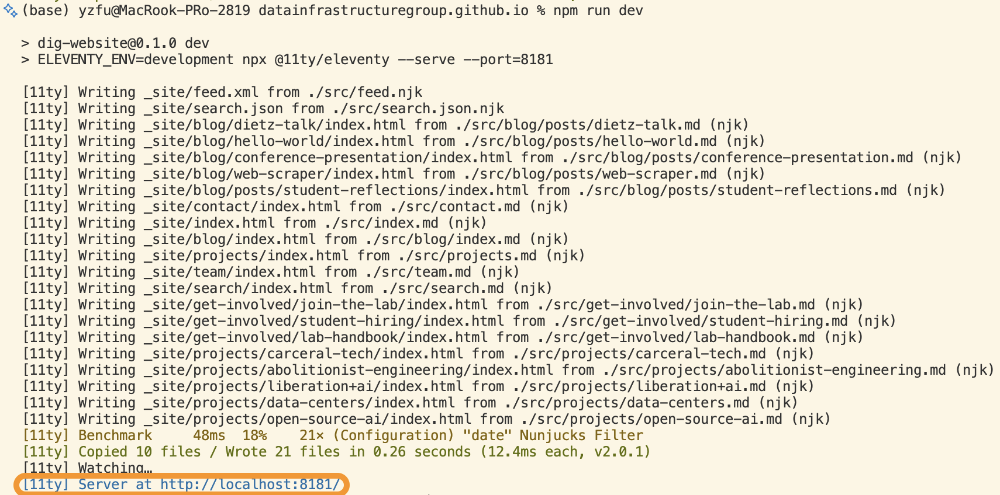
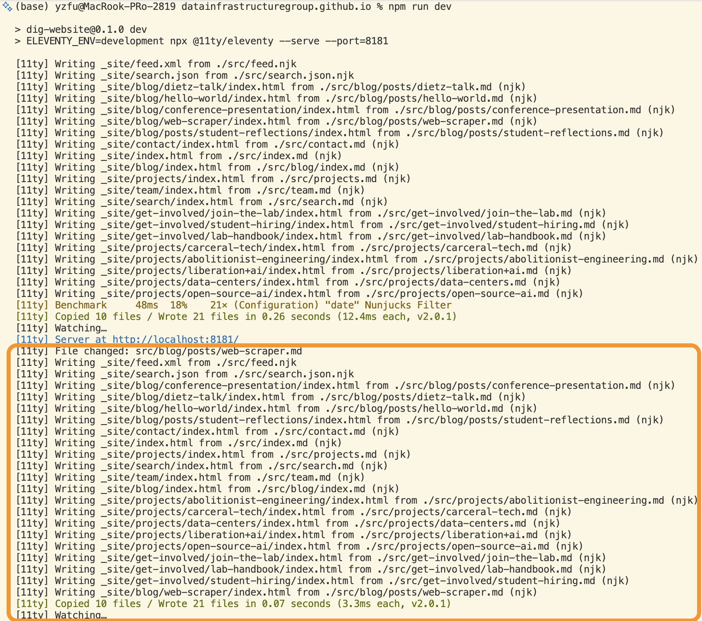

# How to Add a Blog Post to the Lab Repo

If you are setting up this repo for the first time, follow steps 1–2. These steps come from the installation instructions under `Getting Started` > `Prerequisites`. Otherwise, jump to step 3.

---

1. Install `Node.js` and `Git`.

2. Run the following command in the terminal:

   ```bash
   npm install
   ```

   
   _Terminal showing `npm install`_

   > **Note:** I ran it in the VSCode terminal, but you can run it in any terminal.

---

3. Put the `.md` file in `src/blog/posts/`, and place images in `src/assets/img/`.

   > **Note:** If you have multiple images, consider creating a subfolder to keep `src/assets/img/` clean.

   
   _Where my posts are stored_

   
   _Where my images are stored_

4. Add the following `YAML` front matter at the beginning of the post. Replace the content with square brackets.

   ```yaml
   ---
   layout: layouts/post.njk
   title: [Replace with your title]
   category: [Check docs/blog-categories.md and assign a category to your post]
   excerpt: [Replace with your excerpt]
   date: [Fill in the date using YYYY-MM-DD]
   permalink: "/blog/{{ page.fileSlug }}/"
   ---
   ```

5. Update the image paths in the `.md` file. Below is a code template ready to use.

   ```markdown
   <!-- Image -->

   

   <!-- Image caption with an optional link -->

   _[Image caption](Link for the caption)_
   ```

   If the caption does not need a link, use plain text instead:

   ```markdown
   _Image caption_
   ```

   > **Note**: The `(Image path)` is the most important part because it determines whether the image can be displayed successfully. `[Image alt text]`, `Image caption`, and `(Link for the caption)` can be changed as needed.

   This is how the code looks like in my blog post:
   
   _Example image code_

6. Save the files, then run the following command in the terminal:

   ```bash
   npm run dev
   ```

   You will see a `localhost` URL in the terminal. Open this URL in your browser to view the website locally and check whether your blog post is displayed successfully.

   
   _Terminal output showing the localhost URL_

   When a file is changed and saved, the local website should update automatically. The terminal should also show that the site has been rebuilt.

   
   _Updated terminal output_

   When you are done previewing the website, press `Ctrl+C` in the terminal to stop the Eleventy development server.

7. Run the production build to check for build errors:

   ```bash
   npm run build
   ```

8. Create a new branch, commit your changes, push the branch, and open a pull request.

   ```bash
   git checkout -b [branch-name]
   git add .
   git commit -m "[commit message]"
   git push -u origin [branch-name]
   ```

9. For more resources, you can:
   - Search for `Markdown tutorial` online.
   - Check other posts under the `src/blog/posts/` folder.
